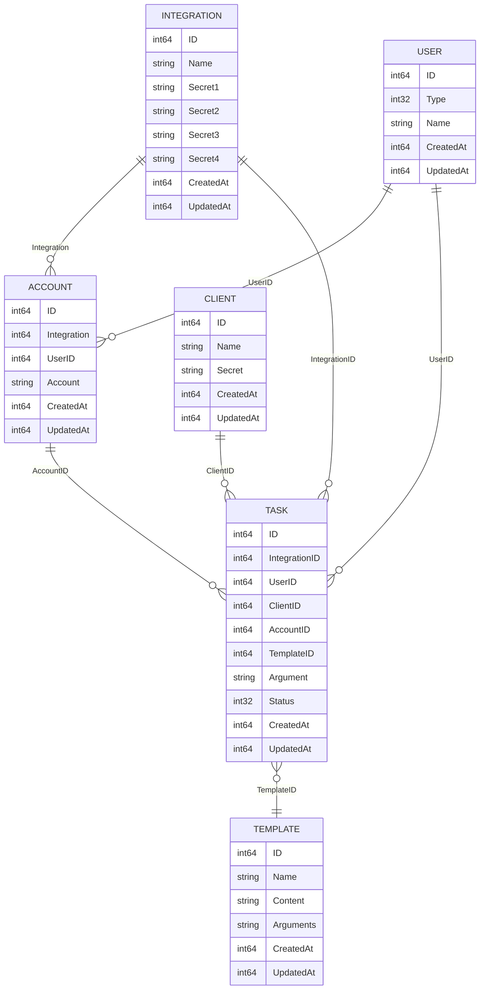

# 远焦数据库文档

## 数据表

|      表名      |     描述     |         说明          |                 详细文档                  |
|:------------:|:----------:|:-------------------:|:-------------------------------------:|
|    users     |   用户信息表    |     用于存储用户的基础信息     |         |
|   clients    |   客户端信息表   | 用于存储调用客户端的信息，包含密钥信息 |       |
| integrations |   集成密钥表    |  用于存储第三方集成通知的密钥信息   |  |
|   accounts   | 用户被通知账户信息表 |  用于存储用户在第三方集成的账号信息  |      |
|    tasks     |   任务信息表    |    用于存储通知任务的执行信息    |         |
|  templates   |   模板信息表    |     用于存储通知模板的信息     |     |

## 实体关系

这些数据表的简单实体关系图如下：

